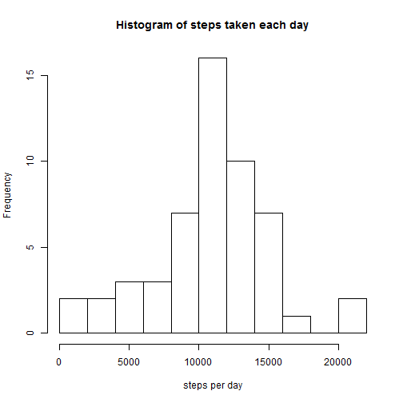
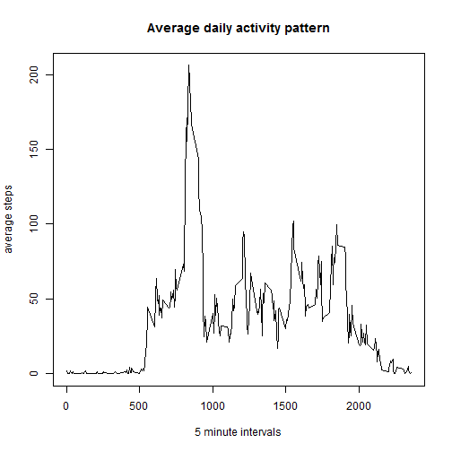
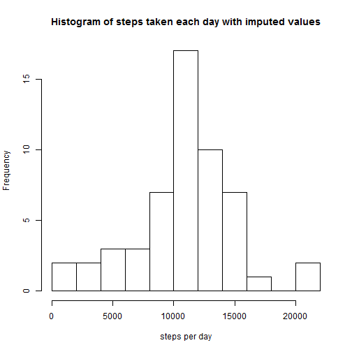
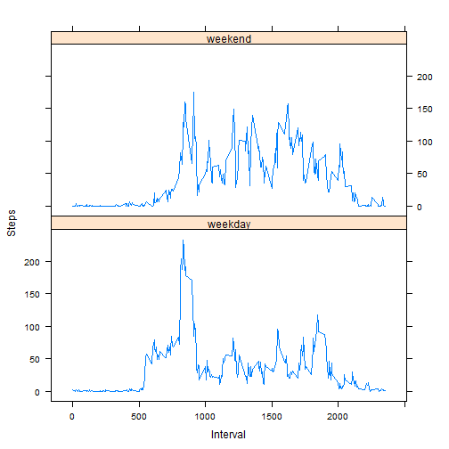

# Reproducible Research: Peer Assessment 1

## Loading and preprocessing the data

```r
unzip("activity.zip")
activity <- read.csv("activity.csv")
```

## What is mean total number of steps taken per day?
Aggregate to get number of steps per day:

```r
stepsPerDay <- aggregate(steps ~ date, activity, sum)
```
### Histogram of total number of steps taken each day

```r
hist(stepsPerDay$steps, breaks = 10, main = "Histogram of steps taken each day", xlab = "steps per day")
```



### Calculating mean and median of steps per day

```r
meanStepsPerDay <- mean(stepsPerDay$steps)
medianStepsPerDay <- median(stepsPerDay$steps)
```
Mean Steps per day are:

```r
meanStepsPerDay
```

```
## [1] 10766.19
```
Median steps per day are:

```r
medianStepsPerDay
```

```
## [1] 10765
```

## What is the average daily activity pattern?

Aggregate to get mean of steps per interval and plot the result:

```r
averageStepsPerInterval <- aggregate(steps ~ interval, activity, mean)
plot(averageStepsPerInterval$interval, averageStepsPerInterval$steps, type = "l", main = "Average daily activity pattern", xlab = "5 minute intervals", ylab = "average steps")
```



Get the 5-minute interval which, on average across all the days in the dataset, contains the maximum number of steps:

```r
averageStepsPerInterval[which.max(averageStepsPerInterval$steps), 1]
```

```
## [1] 835
```

## Imputing missing values
Total number of missing values in the data set:


```r
sum(is.na(activity))
```

```
## [1] 2304
```

If steps are missing, use average steps of this interval instead:


```r
activityNew <- transform(activity, steps = ifelse(is.na(steps), averageStepsPerInterval[averageStepsPerInterval$interval == interval, 2], steps))
```

Aggregate to get number of steps per day:

```r
stepsPerDayNew <- aggregate(steps ~ date, activityNew, sum)
```

### Histogram of total number of steps taken each day


```r
hist(stepsPerDayNew$steps, breaks = 10, main = "Histogram of steps taken each day with imputed values", xlab = "steps per day")
```



### Calculating mean and median of steps per day

```r
meanStepsPerDayNew <- mean(stepsPerDayNew$steps)
medianStepsPerDayNew <- median(stepsPerDayNew$steps)
```
Mean Steps per day are now:

```r
meanStepsPerDayNew
```

```
## [1] 10766.19
```
Median Steps per day are now:

```r
medianStepsPerDayNew
```

```
## [1] 10765.59
```

The mean stays the same, the median is just a little bit higher than before. So imputing missing values has nearly no impact.


## Are there differences in activity patterns between weekdays and weekends?

```r
Sys.setlocale("LC_TIME", "English")
```

```
## [1] "English_United States.1252"
```

```r
weekend <- c("Saturday", "Sunday")
activityNew$day_type <- factor(ifelse(weekdays(as.Date(activityNew$date, "%Y-%m-%d")) %in% weekend, "weekend", "weekday"))
averageStepsPerIntervalDayType <- aggregate(steps ~ interval + day_type, activityNew, mean)
library(lattice)
xyplot(steps ~ interval | day_type, averageStepsPerIntervalDayType, type = "l", layout = c(1,2), xlab = "Interval", ylab = "Steps")
```



The plot shows that there are differences in activity patterns between weekdays and weekends.
